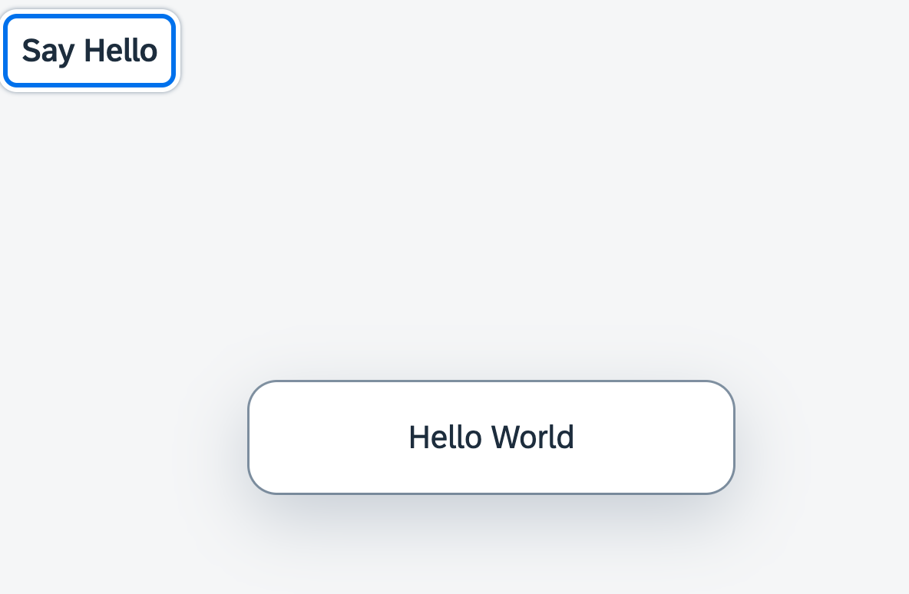

## Step 6: Modules

In OpenUI5, resources are often referred to as modules. In this step, we replace the alert from the last exercise with a proper Message Toast from the `sap.m` library.

&nbsp;

***

### Preview



You can access the live preview by clicking on this link: [🔗 Live Preview of Step 6](https://ui5.github.io/tutorials/walkthrough/build/06/index-cdn.html).

***

### Coding

You can download the solution for this step here: <span class="ts-only">[📥 Download step 6](https://ui5.github.io/tutorials/walkthrough/walkthrough-step-06.zip)<span class="lang-suffix"> (TS)</span></span><span class="js-only">[📥 Download step 6](https://ui5.github.io/tutorials/walkthrough/walkthrough-step-06-js.zip)<span class="lang-suffix"> (JS)</span></span>.
***

### webapp/controller/App.controller.ts/.js

We now replace the native `alert` function with the `show` method of the `sap.m.MessageToast` control of OpenUI5. 



```ts
// webapp/controller/App.controller.ts
import MessageToast from "sap/m/MessageToast";
import Controller from "sap/ui/core/mvc/Controller";

/**
 * @name ui5.tutorial.walkthrough.controller.App
 */
export default class AppController extends Controller {
	onShowHello(): void {
		MessageToast.show("Hello World");
	 }
};

```



```js
// webapp/controller/App.controller.js
sap.ui.define(["sap/m/MessageToast", "sap/ui/core/mvc/Controller"], function (MessageToast, Controller) {
	"use strict";

	/**
	 * @name ui5.tutorial.walkthrough.controller.App
	 */
	const AppController = Controller.extend("ui5.tutorial.walkthrough.controller.App", {
		onShowHello() {
			MessageToast.show("Hello World");
		}
	});
	;
	return AppController;
});

```


For now, the message toast just displays a static "Hello World" message. We will show how to load a translated text here in [Step 8: Translatable Texts](../08/README.md).

&nbsp;

***

**Next:** [Step 7: JSON Model](../07/README.md)

**Previous:** [Step 5: Controllers](../05/README.md)

***

**Related Information**  

[API Reference: `sap.m.MessageToast`](https://sdk.openui5.org/api/sap.m.MessageToast#methods)
