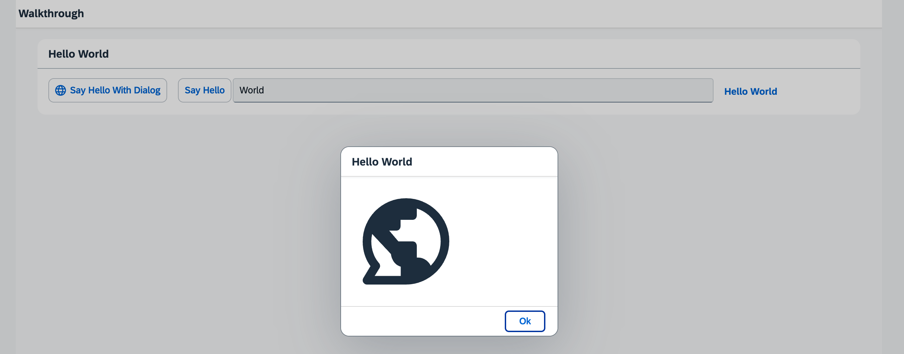

## Step 18: Icons

Our dialog is still pretty much empty. Since OpenUI5 is shipped with a large icon font that contains more than 500 icons, we will add an icon to greet our users when the dialog is opened.

&nbsp;

***

### Preview
  


You can access the live preview by clicking on this link: [🔗 Live Preview of Step 18](https://ui5.github.io/tutorials/walkthrough/build/18/index-cdn.html).
***

### Coding

You can download the solution for this step here: <span class="ts-only">[📥 Download step 18](https://ui5.github.io/tutorials/walkthrough/walkthrough-step-18.zip)<span class="lang-suffix"> (TS)</span></span><span class="js-only">[📥 Download step 18](https://ui5.github.io/tutorials/walkthrough/walkthrough-step-18-js.zip)<span class="lang-suffix"> (JS)</span></span>.
***

### webapp/view/HelloPanel.view.xml

We add an icon to the button that opens the dialog. The `sap-icon://` protocol is indicating that an icon from the *SAP icon font* should be loaded. The identifier `world` is the readable name of the icon in the icon font.


```xml
<mvc:View
   controllerName="ui5.tutorial.walkthrough.controller.HelloPanel"
   xmlns="sap.m"
   xmlns:mvc="sap.ui.core.mvc">
   <Panel
    headerText="{i18n>helloPanelTitle}"
    class="sapUiResponsiveMargin"
    width="auto" >
    <content>
     <Button
      id="helloDialogButton"
      icon="sap-icon://world"
      text="{i18n>openDialogButtonText}"
      press=".onOpenDialog"
      class="sapUiSmallMarginEnd"/>
     <Button
      text="{i18n>showHelloButtonText}"
      press=".onShowHello"
      class="myCustomButton"/>
     <Input
      value="{/recipient/name}"
      valueLiveUpdate="true"
      width="60%"/>
     <FormattedText
      htmlText="Hello {/recipient/name}"
      class="sapUiSmallMargin sapThemeHighlight-asColor myCustomText"/>
    </content>
   </Panel>
</mvc:View>
```

&nbsp;
> 💡
> You can look up other icons using the [Icon Explorer tool](https://sdk.openui5.org/test-resources/sap/m/demokit/iconExplorer/webapp/index.html).
> To call any icon, use its name as listed in the *Icon Explorer* in <code>sap-icon://<i>&lt;iconname&gt;</i></code>.


### webapp/view/HelloDialog.fragment.xml

In the dialog fragment, we add an icon control to the content aggregation of the dialog. Luckily, the icon font also comes with a “Hello World” icon that is perfect for us here. We also define the size of the icon to `8rem` and set a medium margin on it.


```xml
<core:FragmentDefinition
   xmlns="sap.m"
   xmlns:core="sap.ui.core" >
   <Dialog
      id="helloDialog"
      title="Hello {/recipient/name}">
      <content>
         <core:Icon
            src="sap-icon://hello-world"
            size="8rem"
            class="sapUiMediumMargin"/>
      </content>
      <beginButton>
         <Button
            text="{i18n>dialogCloseButtonText}"
            press=".onCloseDialog"/>
      </beginButton>
   </Dialog>
</core:FragmentDefinition>
```


***

### Conventions

-   Always use icon fonts rather than images wherever possible, as they are scalable without quality loss \(vector graphics\) and do not need to be loaded separately.

&nbsp;

***

**Next:** [Step 19: Aggregation Binding](../19/README.md)

**Previous:** [Step 17: Fragment Callbacks](../17/README.md)

***

**Related Information**

[Icon and Icon Pool](https://sdk.openui5.org/topic/21ea0ea94614480d9a910b2e93431291 "The sap-icon:// protocol supports the use of icons in your application based on the icon font concept, which uses an embedded font instead of a pixel image.")

[API Reference: `sap.ui.core.Icon`](https://sdk.openui5.org/#/api/sap.ui.core.Icon)

[Samples: `sap.ui.core.Icon` ](https://sdk.openui5.org/#/entity/sap.ui.core.Icon)

