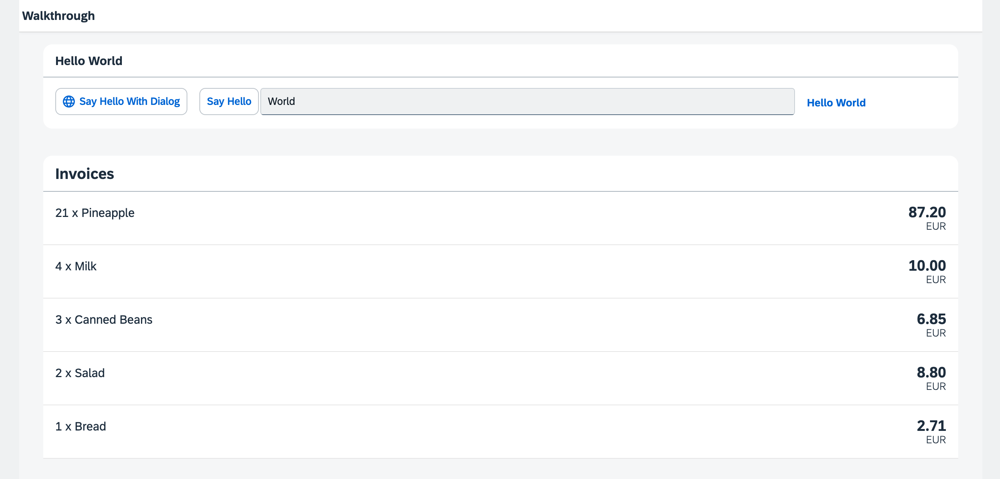

## Step 20: Data Types

The list of invoices is already looking nice, but what is an invoice without a price assigned? Typically prices are stored in a technical format and with a '`.`' delimiter in the data model. For example, our invoice for pineapples has the calculated price `87.2` without a currency. We are going to use the OpenUI5 data types to format the price properly, with a locale-dependent decimal separator and two digits after the separator.

&nbsp;

***

### Preview
  


You can access the live preview by clicking on this link: [🔗 Live Preview of Step 20](https://ui5.github.io/tutorials/walkthrough/build/20/index-cdn.html).
***

### Coding

You can download the solution for this step here: <span class="ts-only">[📥 Download step 20](https://ui5.github.io/tutorials/walkthrough/walkthrough-step-20.zip)<span class="lang-suffix"> (TS)</span></span><span class="js-only">[📥 Download step 20](https://ui5.github.io/tutorials/walkthrough/walkthrough-step-20-js.zip)<span class="lang-suffix"> (JS)</span></span>.
***

### webapp/controller/InvoiceList.controller.ts/.js \(New\)

We want to display in our list view the price in Euro. Since currency information isn't available in our backend data model, we'll handle the currency formatting within the application.

We'll create a controller for the InvoiceList view and use a JSON model (`sap/ui/model/json/JSONModel`) to store the currency code. This model will contain a single property, `currency: "EUR"`, which will be used for formatting the prices in the view.


```ts
// webapp/controller/InvoiceList.controller.ts
import Controller from "sap/ui/core/mvc/Controller";
import JSONModel from "sap/ui/model/json/JSONModel";

/**
 * @namespace ui5.tutorial.walkthrough.controller
 */
export default class App extends Controller {
	
	onInit(): void {
		const viewModel = new JSONModel({
			currency: "EUR"
		});
		this.getView()?.setModel(viewModel, "view");        
	} 
};

```



```js
// webapp/controller/InvoiceList.controller.js
sap.ui.define(["sap/ui/core/mvc/Controller", "sap/ui/model/json/JSONModel"], function (Controller, JSONModel) {
	"use strict";

	const App = Controller.extend("ui5.tutorial.walkthrough.controller.App", {
		onInit() {
			const viewModel = new JSONModel({
				currency: "EUR"
			});
			this.getView()?.setModel(viewModel, "view");
		}
	});
	;
	return App;
});

```


### webapp/view/InvoiceList.view.xml

We add the invoice list controller to the view to get access to the view model we defined in the controller. 

We add a price and the currency to our invoices list in the view by adding the `number` attribute to the `ObjectListItem` control. To apply the currency data type, we use the `require` attribute with the namespace URI `sap.ui.core`, for which the prefix `core` is already defined in our XML view. This allows us to write the attribute as `core:require`. We then add the currency data type module to the list of required modules and assign it the alias `Currency`, making it available for use within the view. Then we set the `type` attribute of the binding syntax to the alias `Currency`. The `Currency` type will handle the formatting of the price for us, based on the currency code. In our case, the price is displayed with 2 decimals.

Additionally, we set the formatting option `showMeasure` to `false`. This hides the currency code in the property `number`. Instead we pass the currency on to the `ObjectListItem` control as a separate property `numberUnit`.


```xml
<mvc:View
   controllerName="ui5.tutorial.walkthrough.controller.InvoiceList"
   xmlns="sap.m"
   xmlns:core="sap.ui.core"
   xmlns:mvc="sap.ui.core.mvc">
   <List
      headerText="{i18n>invoiceListTitle}"
      class="sapUiResponsiveMargin"
      width="auto"
      items="{invoice>/Invoices}" >
      <items>
         <ObjectListItem
            core:require="{
               Currency: 'sap/ui/model/type/Currency'
            }"
            title="{invoice>Quantity} x {invoice>ProductName}"
            number="{
               parts: [
                  'invoice>ExtendedPrice', 
                  'view>/currency'
               ],
               type: 'Currency',
               formatOptions: {
                  showMeasure: false
               }
            }"
            numberUnit="{view>/currency}"/>
      </items>
   </List>
</mvc:View>
```


As you can see above, the example uses a special binding syntax for the `number` property of the `ObjectListItem`. This binding syntax uses [Composite Binding](https://sdk.openui5.org/topic/a2fe8e763014477e87990ff50657a0d0), which allows you to bind multiple properties from different models to a single control property. The properties bound from different models are called parts. In the example above, the control property is `number` and the bound properties \(parts\) are retrieved from two different models: `invoice>ExtendedPrice` and `view>/currency`.

***

### Convention

- Use data types instead of custom formatters whenever possible.

&nbsp;

***

**Next:** [Step 21: Expression Binding](../21/README.md)

**Previous:** [Step 19: Aggregation Binding](../19/README.md)

***

**Related Information**  
[Composite Binding](https://sdk.openui5.org/topic/a2fe8e763014477e87990ff50657a0d0.html "Calculated fields enable the binding of multiple properties in different models to a single property of a control.")

[Formatting, Parsing, and Validating Data](https://sdk.openui5.org/topic/07e4b920f5734fd78fdaa236f26236d8.html "Data that is presented on the UI often has to be converted so that is human readable and fits to the locale of the user. On the other hand, data entered by the user has to be parsed and validated to be understood by the data source. For this purpose, you use formatters and data types.")

[Require Modules in XML View and Fragment](https://sdk.openui5.org/topic/b11d853a8e784db6b2d210ef57b0f7d7.html "Modules can be required in XML views and fragments and assigned to aliases which can be used as variables in properties, event handlers, and bindings.")

[API Reference: sap.ui.base.ManagedObject](https://sdk.openui5.org/api/sap.ui.base.ManagedObject)

[API Reference: sap.ui.base.ManagedObject.PropertyBindingInfo](https://sdk.openui5.org/api/sap.ui.base.ManagedObject.PropertyBindingInfo)

[API Reference: `sap.ui.model.type`](https://sdk.openui5.org/#/api/sap.ui.model.type)

[API Reference: sap.ui.model.type.Currency](https://sdk.openui5.org/api/sap.ui.model.type.Currency)

[Samples: sap.ui.model.type.Currency](https://sdk.openui5.org/entity/sap.ui.model.type.Currency)
