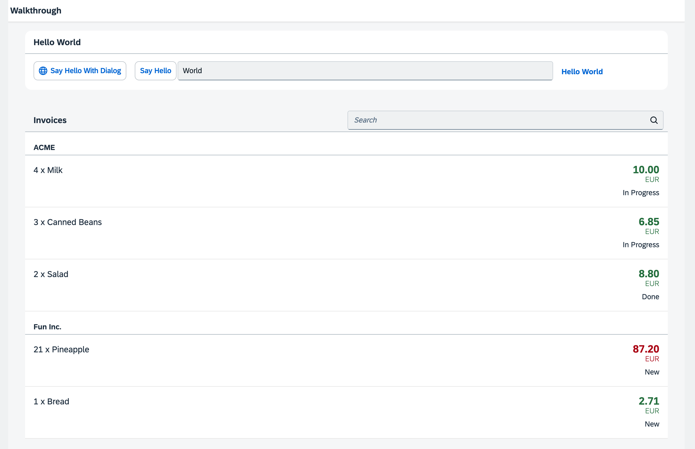

## Step 24: Sorting and Grouping

To make our list of invoices even more user-friendly, we sort it alphabetically instead of just showing the order from the data model. Additionally, we introduce groups and add the company that ships the products so that the data is easier to consume.

&nbsp;

***

### Preview
  



You can access the live preview by clicking on this link: [🔗 Live Preview of Step 24](https://ui5.github.io/tutorials/walkthrough/build/24/index-cdn.html).

***

### Coding

You can download the solution for this step here: <span class="ts-only">[📥 Download step 24](https://ui5.github.io/tutorials/walkthrough/walkthrough-step-24.zip)<span class="lang-suffix"> (TS)</span></span><span class="js-only">[📥 Download step 24](https://ui5.github.io/tutorials/walkthrough/walkthrough-step-24-js.zip)<span class="lang-suffix"> (JS)</span></span>.
***

### webapp/view/InvoiceList.view.xml

We add a declarative sorter to the binding syntax of the list control. Therefore, we transform the simple binding syntax to the object notation, specify the path to the data, and now add an additional `sorter` property. In the path of the sorter, we specify that the invoice items should be sorted by Product Name, and OpenUI5 will take care of the rest. 


```xml
<mvc:View
   controllerName="ui5.tutorial.walkthrough.controller.InvoiceList"
   xmlns="sap.m"
   xmlns:core="sap.ui.core"
   xmlns:mvc="sap.ui.core.mvc">
   <List
      id="invoiceList"
      class="sapUiResponsiveMargin"
      width="auto"
      items="{
         path: 'invoice>/Invoices',
         sorter: {
				path: 'ProductName',
			}
      }" >
      ...
</mvc:View>
```


By default, the sorting is ascending, but you could also add a property `descending` with the value `true` inside the sorter property to change the sorting order.
  
If we run the app now we can see a list of invoices sorted by the name of the products.

### webapp/view/InvoiceList.view.xml

We modify the view and change the sorter so the path addresses to the `ShipperName` data field instead of `ProductName`. This groups the invoice items by the shipping company. In addition set the sorter attribute `group` to true.

As with the sorter, no further action is required. The list and the data binding features of OpenUI5 will do the trick to display group headers automatically and categorize the items in the groups.

```xml
<mvc:View
   controllerName="ui5.tutorial.walkthrough.controller.InvoiceList"
   xmlns="sap.m"
   xmlns:core="sap.ui.core"
   xmlns:mvc="sap.ui.core.mvc">
   <List
      id="invoiceList"
      class="sapUiResponsiveMargin"
      width="auto"
      items="{
         path: 'invoice>/Invoices',
         sorter: {
				path: 'ShipperName',
				group: true
			}
      }" >
      ...
```    
  
We could define a custom group header factory if we wanted by setting the `groupHeaderFactory` property, but the result looks already fine.

&nbsp; 

***

**Next:** [Step 25: Remote OData Service](../25/README.md)

**Previous:** [Step 23: Filtering](../23/README.md)

***

**Related Information**  

[API Reference: `sap.ui.model.Sorter`](https://sdk.openui5.org/#/api/sap.ui.model.Sorter)

[Sample: List - Grouping](https://sdk.openui5.org/#/entity/sap.m.List/sample/sap.m.sample.ListGrouping)
